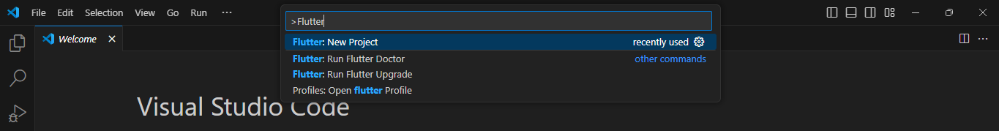

# Nama: Dela Farahita Zain
# NIM: 2241720058
# Kelas: D-IV TI / 3B

# Tugas Praktikum
1. Selesaikan Praktikum 1 sampai 5, lalu dokumentasikan dan push ke repository Anda berupa screenshot setiap hasil pekerjaan beserta penjelasannya di file README.md!
2. Selesaikan Praktikum 2 dan Anda wajib menjalankan aplikasi hello_world pada perangkat fisik (device Android/iOS) agar Anda mempunyai pengalaman untuk menghubungkan ke perangkat fisik. Capture hasil aplikasi di perangkat, lalu buatlah laporan praktikum pada file README.md.
3. Pada praktikum 5 mulai dari Langkah 3 sampai 6, buatlah file widget tersendiri di folder basic_widgets, kemudian pada file main.dart cukup melakukan import widget sesuai masing-masing langkah tersebut!
4. Selesaikan Codelabs: Your first Flutter app, lalu buatlah laporan praktikumnya dan push ke repository GitHub Anda!
5. README.md berisi: capture hasil akhir tiap praktikum (side-by-side, bisa juga berupa file GIF agar terlihat proses perubahan ketika ada aksi dari pengguna) dengan menampilkan NIM dan Nama Anda sebagai ciri pekerjaan Anda.

## Praktikum 1: Membuat Project Flutter Baru
### Langkah 1:

### Langkah 2:

### Langkah 3:

### Langkah 4:

## Praktikum 2: Menghubungkan Perangkat Android atau Emulator

## Praktikum 3: Membuat Repository GitHub dan Laporan Praktikum
### Langkah 1:

### Langkah 2:

### Langkah 3:

### Langkah 4:

### Langkah 5:

### Langkah 8:

### Langkah 10:

### Langkah 11:

### Langkah 12:

## Praktikum 4: Menerapkan Widget Dasar
### Langkah 1: Text Widget

### Langkah 2: Image Widget

## Praktikum 5: Menerapkan Widget Material Design dan iOS Cupertino
### Langkah 1: Cupertino Button dan Loading Bar

### Langkah 2: Floating Action Button (FAB)

### Langkah 3: Scaffold Widget

### Langkah 4: Dialog Widget

### Langkah 5: Input dan Selection Widget

### Langkah 6: Date and Time Pickers

## Codelabs: Your first Flutter app
### Copy & Paste the initial app

### Add a button
Launch the app:

First Hot Reload:

Adding a button:

A Flutter crash course in 5 minutes:

Your first behavior:

### Make the app prettier

### Add functionality

### Add navigation rail

### Add a new page

